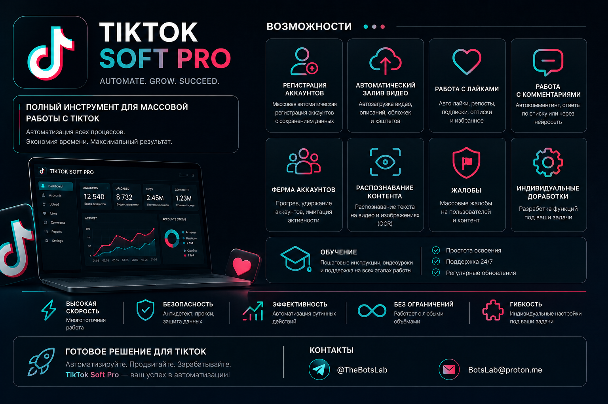

# TikTok Account Registrator — browser workflow automation

  

<strong>Управляемые браузерные процессы для разрешённой работы с собственными или авторизованно администрируемыми TikTok-аккаунтами.</strong>

  <a href="docs/README.en.md">English</a> ·
  <a href="docs/README.uk.md">Українська</a> ·
  <a href="docs/README.zh-CN.md">中文</a> ·
  <a href="docs/README.he.md">עברית</a>

> **Независимый продукт.** Проект не связан с TikTok или ByteDance, не одобрен, не спонсируется и не сертифицирован ими. TikTok — товарный знак соответствующего правообладателя.

## О продукте

**TikTok Account Registrator** — коммерческое решение для автоматизации разрешённых браузерных процессов с TikTok-аккаунтами, которыми пользователь владеет или имеет право администрировать. Подходит для управляемых рабочих процессов, где требуется организация служебных данных, профилей автоматизации, контентных операций и истории действий.

Решение работает через браузерную автоматизацию. Состав поставки и допустимые сценарии согласуются индивидуально до покупки.

## Возможности

- Браузерные workflow для операций с авторизованными аккаунтами.
- Организация служебных данных и профилей автоматизации в контролируемой среде.
- Поддержка профилей ZennoPoster для разрешённых сценариев.
- Настраиваемые процессы для загрузки собственного контента, планирования публикаций, обработки входящих комментариев и рабочих коммуникаций.
- Мониторинг статусов, подготовка отчётности и адаптация под согласованный бизнес-процесс.
- Индивидуальные доработки под разрешённые задачи клиента.

## Ответственное использование

- Используйте решение только для аккаунтов и данных, на которые у вас есть законные права.
- Соблюдайте правила TikTok, требования к персональным данным, применимое законодательство и ограничения платформы.
- Решение не заявляет и не предназначено для обхода защит, антифрода, лимитов, блокировок или других ограничений платформы.
- Не используйте продукт для спама, искусственного вовлечения, накрутки, массовых жалоб, несанкционированного доступа или иных нарушений.

## Контакты

- Telegram: [@TheBotsLab](https://t.me/TheBotsLab)
- E-mail: [BotsLab@proton.me](mailto:BotsLab@proton.me)

## Источник и материалы

Исходный оффер: [ZennoClub — «Регистратор TikTok аккаунтов»](https://zenno.club/discussion/threads/registrator-tiktok-akkauntov.120227/).

Иллюстрация в `assets/` предоставлена в материале оффера и временно используется как product visual. В ней присутствуют сторонние товарные знаки и рекламные формулировки автора оффера; они не означают связь или одобрение со стороны TikTok/ByteDance. В дальнейшем иллюстрация будет заменена нейтральной обложкой без сторонних логотипов.

## Public-safety boundary

Репозиторий содержит только публичную продуктовую документацию. Здесь нет внутреннего производственного кода, доступа к аккаунтам, cookies, токенов, прокси-реквизитов, номеров телефонов, клиентских данных или журналов операций.
